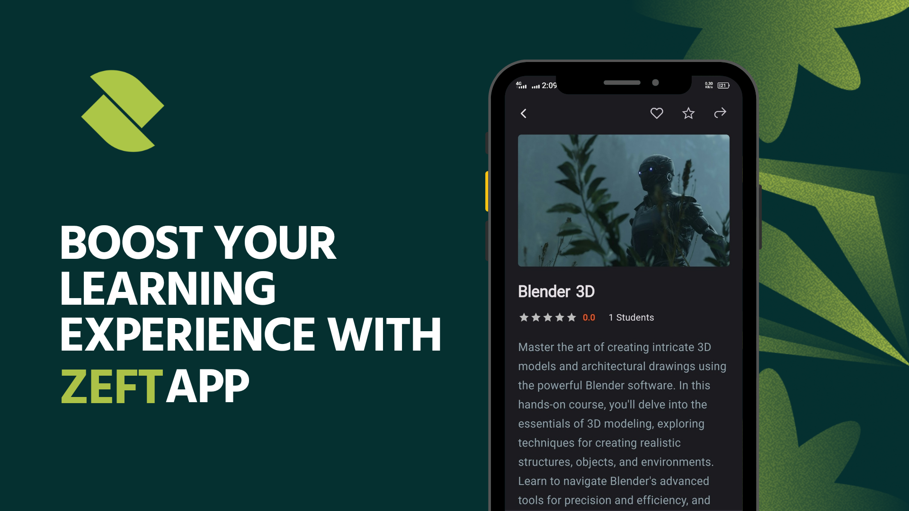

# Zeft - Education Android App

Zeft is an innovative educational app designed to enhance the learning experience for students of all ages. With a focus on interactive content, personalized learning paths, and real-time progress tracking, Zeft makes education engaging and accessible.

## Features

- **Interactive Lessons**: Engage with multimedia lessons that include videos, quizzes, and interactive exercises.
- **Personalized Learning Paths**: Customize your learning journey based on your interests and proficiency levels.
- **Progress Tracking**: Monitor your progress with detailed reports and analytics.
- **Offline Mode**: Access your lessons and content even when you're offline.
- **Gamification**: Earn rewards and badges as you complete lessons and achieve milestones.
- **Community Support**: Join study groups, participate in discussions, and get help from peers and educators.

## Installation

To install Zeft on your Android device, follow these steps:

1. **Download the APK**: [Download Zeft APK](https://zeft.pk/)
2. **Enable Unknown Sources**: Go to `Settings` > `Security` > `Unknown Sources` and enable it.
3. **Install the APK**: Open the downloaded APK file and follow the on-screen instructions to install Zeft.
4. **Launch the App**: Find the Zeft app icon on your home screen or app drawer and tap to open.

## Screenshots

### Home Screen

### Interactive Lessons

### Progress Tracking

### Personalized Learning Paths

## Usage

1. **Sign Up / Log In**: Create a new account or log in with your existing credentials.
2. **Explore Courses**: Browse through a variety of courses and select the ones that interest you.
3. **Start Learning**: Begin your lessons, complete exercises, and track your progress.
4. **Join the Community**: Participate in discussions, join study groups, and collaborate with peers.

## Contributing

We welcome contributions to Zeft! To contribute, follow these steps:

1. Fork the repository.
2. Create a new branch (`git checkout -b feature/your-feature`).
3. Make your changes and commit them (`git commit -m 'Add some feature'`).
4. Push to the branch (`git push origin feature/your-feature`).
5. Open a pull request.

## License

Zeft is licensed under the MIT License.

## Contact

For support or inquiries, please contact us at zulkaif@zeft.com.
